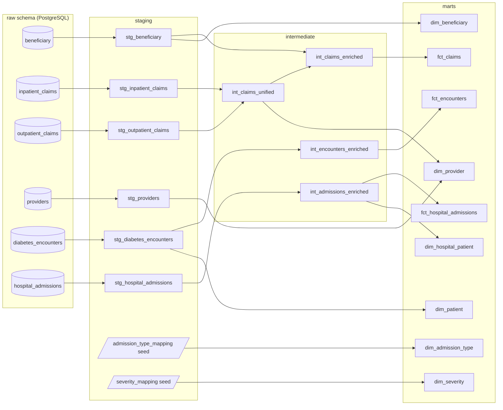

# Clinical Data ETL Pipeline

A multi-source clinical data ETL pipeline that ingests three heterogeneous healthcare datasets — Medicare claims fraud detection (4 related CSV tables), UCI diabetes-readmission hospital encounters, and synthetic hospital admissions (length-of-stay) — validates each with pandera, stages into PostgreSQL, transforms with dbt into **three independent star schemas**, and orchestrates with Prefect.

Built as a portfolio project for Data Engineering / Analytics Engineering roles.

[](https://github.com/ksdisch/clinical-data-etl/actions/workflows/ci.yml)

## Architecture

```
  data/raw/claims_fraud/
  ┌──────────────────────────────────────────────┐
  │  Train + Test Beneficiary CSVs               │
  │  Train + Test Inpatient Claims CSVs          │
  │  Train + Test Outpatient Claims CSVs         │
  │  Train + Test Provider Labels CSVs           │
  └──────────────────┬───────────────────────────┘
                     ▼
  ┌──────────────────────────────────────────────┐
  │  Ingestion (Python)                          │
  │  Per-table pandera schemas                   │
  │  Merge Train/Test splits → single tables     │
  │  Nullable fraud flag for Test providers      │
  └──────────────────┬───────────────────────────┘
                     ▼
  ┌──────────────────────────────────────────────┐
  │  PostgreSQL — raw schema                     │
  │  raw.beneficiary                             │
  │  raw.inpatient_claims                        │
  │  raw.outpatient_claims                       │
  │  raw.providers                               │
  └──────────────────┬───────────────────────────┘
                     ▼
  ┌──────────────────────────────────────────────┐
  │  dbt — staging → intermediate → marts        │
  │                                              │
  │  staging:      stg_beneficiary               │
  │                stg_inpatient_claims           │
  │                stg_outpatient_claims          │
  │                stg_providers                  │
  │                                              │
  │  intermediate: int_claims_unified              │
  │                int_claims_enriched             │
  │                                              │
  │  marts:        fct_claims                    │
  │                dim_beneficiary               │
  │                dim_provider (+ fraud label)   │
  └──────────────────────────────────────────────┘

  Orchestrated by Prefect
```

## Star Schema ERD

```
┌─────────────────────────────┐
│       dim_beneficiary       │
├─────────────────────────────┤
│ bene_id              (PK)   │
│ date_of_birth               │
│ date_of_death               │
│ gender                      │
│ race                        │
│ state_code                  │
│ county_code                 │
│ has_alzheimers  ... (×11)   │
│ chronic_condition_count     │
│ total_ip_reimbursement      │
│ total_op_reimbursement      │
└──────────────┬──────────────┘
               │ bene_id
               │
┌──────────────┴──────────────┐
│          fct_claims         │
├─────────────────────────────┤
│ claim_id             (PK)   │
│ bene_id              (FK)───┘
│ provider_id          (FK)───┐
│ claim_type                  │
│ claim_start_date            │
│ claim_end_date              │
│ admission_date              │
│ discharge_date              │
│ claim_duration_days         │
│ reimbursement_amount        │
│ deductible_amount           │
│ age_at_claim                │
│ diagnosis_code_1 ... (×10)  │
│ procedure_code_1 ... (×6)   │
└──────────────┬──────────────┘
               │ provider_id
               │
┌──────────────┴──────────────┐
│        dim_provider         │
├─────────────────────────────┤
│ provider_id          (PK)   │
│ is_potential_fraud          │
│ total_claims                │
│ total_reimbursement         │
│ unique_beneficiaries        │
│ avg_reimbursement_per_claim │
└─────────────────────────────┘
```

## Diabetes Star Schema ERD (second source)

The diabetes-readmission data is modelled as a second, independent star — same
patterns, different domain. There is no key joining it to the claims data.

```
┌─────────────────────────────┐      ┌─────────────────────────────┐
│         dim_patient         │      │     dim_admission_type      │
├─────────────────────────────┤      ├─────────────────────────────┤
│ patient_nbr          (PK)   │      │ admission_type_id    (PK)   │  ← dbt seed
│ race                        │      │ admission_type_label        │
│ gender                      │      └──────────────┬──────────────┘
│ latest_age_bracket          │                     │ admission_type_id
│ total_encounters            │                     │
│ num_readmissions_30d        │      ┌──────────────┴──────────────┐
│ readmission_30d_rate        │      │       fct_encounters        │
└──────────────┬──────────────┘      ├─────────────────────────────┤
               │ patient_nbr         │ encounter_id         (PK)   │
               └─────────────────────│ patient_nbr          (FK)   │
                                     │ admission_type_id    (FK)   │
                                     │ time_in_hospital            │
                                     │ num_lab_procedures          │
                                     │ num_prior_visits            │
                                     │ num_diabetes_meds           │
                                     │ diag_1 ... diag_3           │
                                     │ insulin / metformin         │
                                     │ readmitted_status           │
                                     │ is_readmitted_30d           │
                                     └─────────────────────────────┘
```

## Hospital Star Schema ERD (third source)

The synthetic hospital-admissions data is modelled as a third, independent star.
The source has no usable primary key (`case_id` is recycled across unrelated
admissions), so the grain is a deterministic surrogate minted at ingestion.

```
┌─────────────────────────────┐      ┌─────────────────────────────┐
│     dim_hospital_patient    │      │        dim_severity         │
├─────────────────────────────┤      ├─────────────────────────────┤
│ patient_id           (PK)   │      │ severity_of_illness  (PK)   │  ← dbt seed
│ total_admissions            │      │ severity_rank (1/2/3)       │
│ distinct_hospitals          │      │ severity_description        │
│ avg_length_of_stay_days     │      └──────────────┬──────────────┘
│ total_admission_deposit     │                     │ severity_of_illness
│ avg_admission_deposit       │                     │
└──────────────┬──────────────┘      ┌──────────────┴──────────────┐
               │ patient_id          │   fct_hospital_admissions   │
               └─────────────────────│─────────────────────────────│
                                     │ admission_id         (PK)   │  ← md5(case_id-patientid)
                                     │ patient_id           (FK)   │
                                     │ severity_of_illness  (FK)   │
                                     │ case_id (degenerate)        │
                                     │ hospital/ward/dept codes    │
                                     │ type_of_admission           │
                                     │ age_bracket                 │
                                     │ admission_deposit           │
                                     │ length_of_stay_bracket      │
                                     │ length_of_stay_days         │
                                     │ is_long_stay                │
                                     └─────────────────────────────┘
```

## Data Lineage

The dbt project builds 20 models across three layers (10 for the claims star, 5
for the diabetes star, 5 for the hospital star). Run `make dbt-docs` to generate
and serve the interactive lineage graph; the same dependency structure is shown below.



## Prerequisites

- Python 3.11+
- Docker & Docker Compose
- [Kaggle CLI](https://github.com/Kaggle/kaggle-api) (`pip install kaggle`) with API credentials configured
- Git

## Setup

### 1. Clone and install

```bash
git clone https://github.com/ksdisch/clinical-data-etl.git
cd clinical-data-etl
make setup
```

Or manually:

```bash
python -m venv .venv
source .venv/bin/activate
pip install -e ".[dev]"
```

### 2. Download data

> Requires Kaggle API credentials: place your `kaggle.json` token at `~/.kaggle/kaggle.json` and run `chmod 600 ~/.kaggle/kaggle.json`. See the [Kaggle API docs](https://github.com/Kaggle/kaggle-api#api-credentials).

```bash
make download-data
```

Or manually:

```bash
kaggle datasets download -d rohitrox/healthcare-provider-fraud-detection-analysis -p data/raw/claims_fraud/ --unzip
kaggle datasets download -d brandao/diabetes -p data/raw/diabetes_readmission/ --unzip
kaggle datasets download -d amulyas/synthetic-hospital-data -p data/raw/synthetic_hospital/ --unzip
```

### 3. Start PostgreSQL

```bash
cp .env.example .env   # edit credentials if needed
make db-up
```

### 4. Verify dbt connection

```bash
cd dbt && dbt debug && cd ..
```

### 5. Run the pipeline

```bash
make pipeline
```

## Project Structure

```
src/clinical_data_etl/    Python package (ingestion, orchestration, utils)
dbt/                      dbt project (staging, intermediate, marts models)
tests/                    pytest test suite
data/raw/                 Kaggle datasets (gitignored — see setup instructions)
docs/                     data dictionary, ADRs (docs/adr/), data sources, plans
```

## Makefile Targets

| Target          | Description                                 |
|-----------------|---------------------------------------------|
| `make setup`    | Create venv and install package with dev deps |
| `make download-data` | Download all Kaggle datasets            |
| `make db-up`    | Start PostgreSQL container                  |
| `make db-down`  | Stop PostgreSQL container                   |
| `make test`     | Run pytest                                  |
| `make lint`     | Run ruff linter                             |
| `make pipeline` | Run full ETL pipeline (idempotent: upsert ingest + snapshot + incremental dbt + test) |
| `make pipeline-reset` | Clean rebuild: TRUNCATE raw (snapshots survive) + dbt `--full-refresh` |
| `make pipeline-ingest` | Ingestion only (CSV → PostgreSQL)      |
| `make pipeline-dbt` | dbt only (transform + test)               |
| `make demo-incremental` | Self-verifying proof of incremental adds + idempotency |
| `make demo-scd2` | Self-verifying proof of SCD2 fraud-label history (seeded vintage) |
| `make dbt-compile` | Compile dbt models (validate SQL, no DB writes) |
| `make dbt-docs` | Generate and serve dbt docs + lineage graph     |

## Tech Stack

- **Python** (pandas, pandera) — ingestion and validation
- **PostgreSQL 16** — data warehouse (via Docker)
- **dbt** (dbt-postgres) — SQL transformations and testing
- **Prefect** — workflow orchestration
- **pytest, ruff, mypy** — testing and code quality

## Roadmap

MVP complete as of April 2026. The pipeline ingests all three sources end-to-end in well under a minute (and a re-run is an idempotent no-op in ~1 minute), passes 56 pytest tests and 98 dbt tests (97 pass, 1 expected warn on the orphan-claims relationship).

**Production-shaping (done):** the warehouse uses an **idempotent ON CONFLICT upsert** loader (no more DROP+reload), **incremental** `int_claims_enriched`/`fct_claims`/`fct_encounters` models, and **SCD Type 2** history on the provider fraud label (`snap_provider_fraud` → `dim_provider_history`). Because the claims data is single-vintage, incrementality and history are demonstrated with deterministic, seeded inputs via `make demo-incremental` and `make demo-scd2`. See [`docs/incremental_scd2.md`](docs/incremental_scd2.md).

**Phase 2 — second source (done):** the UCI diabetes-readmission dataset (`brandao/diabetes`, 101,766 encounters, 50 columns) is now wired through the full pipeline as a second, independent star schema — `stg_diabetes_encounters` → `int_encounters_enriched` → `fct_encounters` (incremental) + `dim_patient` + a seed-backed `dim_admission_type`. The `?` missing sentinel is recoded to NULL before pandera validation; the analytical target is 30-day readmission. See [`docs/phase2-diabetes-plan.md`](docs/phase2-diabetes-plan.md).

**Phase 3 — third source (done):** the synthetic hospital-admissions dataset (`amulyas/synthetic-hospital-data`, 5,000 admissions, length-of-stay) is wired as a third, independent star — `stg_hospital_admissions` → `int_admissions_enriched` → `fct_hospital_admissions` (incremental) + `dim_hospital_patient` + a seed-backed `dim_severity`. The source has no usable primary key (`case_id` is recycled), so a deterministic surrogate `admission_id = md5(case_id-patientid)` is minted at ingestion; the Excel `20-Nov`→`11-20` Age/Stay artifact is recoded before validation. The analytical target is length of stay (`is_long_stay` > 30 days). See [`docs/phase3-hospital-plan.md`](docs/phase3-hospital-plan.md).

**Documentation (done):** numbered Architecture Decision Records ([`docs/adr/`](docs/adr/)) capture the load-bearing decisions (ETL-not-ML merge, fraud label in `dim_provider`, independent stars, idempotent upsert, `NOT EXISTS` incremental boundary, SCD2 snapshot, minted surrogate key, seed-backed lookups); a column-level [`docs/data-dictionary.md`](docs/data-dictionary.md) documents every source and mart column across all three stars; and the four intermediate models carry full column descriptions.

Remaining (deferred): a static dbt-lineage screenshot for the README (`make dbt-docs` renders it live; capturing the PNG needs a running DB).
