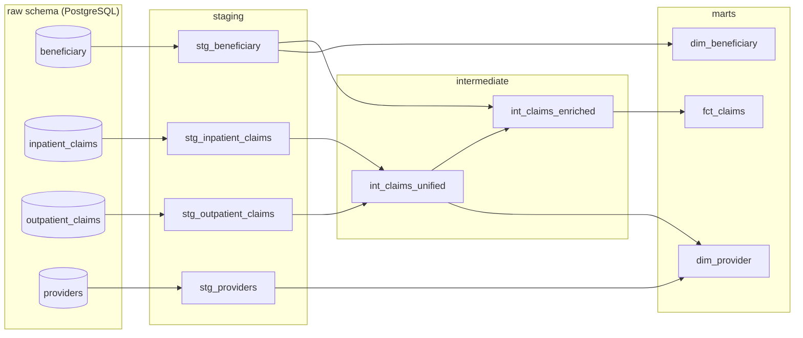

# Clinical Data ETL Pipeline

A multi-source clinical data ETL pipeline that ingests Medicare claims fraud detection data (4 related CSV tables), validates with pandera, stages into PostgreSQL, transforms with dbt into a star schema, and orchestrates with Prefect.

Built as a portfolio project for Data Engineering / Analytics Engineering roles.

[](https://github.com/ksdisch/clinical-data-etl/actions/workflows/ci.yml)

## Architecture

```
  data/raw/claims_fraud/
  ┌──────────────────────────────────────────────┐
  │  Train + Test Beneficiary CSVs               │
  │  Train + Test Inpatient Claims CSVs          │
  │  Train + Test Outpatient Claims CSVs         │
  │  Train + Test Provider Labels CSVs           │
  └──────────────────┬───────────────────────────┘
                     ▼
  ┌──────────────────────────────────────────────┐
  │  Ingestion (Python)                          │
  │  Per-table pandera schemas                   │
  │  Merge Train/Test splits → single tables     │
  │  Nullable fraud flag for Test providers      │
  └──────────────────┬───────────────────────────┘
                     ▼
  ┌──────────────────────────────────────────────┐
  │  PostgreSQL — raw schema                     │
  │  raw.beneficiary                             │
  │  raw.inpatient_claims                        │
  │  raw.outpatient_claims                       │
  │  raw.providers                               │
  └──────────────────┬───────────────────────────┘
                     ▼
  ┌──────────────────────────────────────────────┐
  │  dbt — staging → intermediate → marts        │
  │                                              │
  │  staging:      stg_beneficiary               │
  │                stg_inpatient_claims           │
  │                stg_outpatient_claims          │
  │                stg_providers                  │
  │                                              │
  │  intermediate: int_claims_unified              │
  │                int_claims_enriched             │
  │                                              │
  │  marts:        fct_claims                    │
  │                dim_beneficiary               │
  │                dim_provider (+ fraud label)   │
  └──────────────────────────────────────────────┘

  Orchestrated by Prefect
```

## Star Schema ERD

```
┌─────────────────────────────┐
│       dim_beneficiary       │
├─────────────────────────────┤
│ bene_id              (PK)   │
│ date_of_birth               │
│ date_of_death               │
│ gender                      │
│ race                        │
│ state_code                  │
│ county_code                 │
│ has_alzheimers  ... (×11)   │
│ chronic_condition_count     │
│ total_ip_reimbursement      │
│ total_op_reimbursement      │
└──────────────┬──────────────┘
               │ bene_id
               │
┌──────────────┴──────────────┐
│          fct_claims         │
├─────────────────────────────┤
│ claim_id             (PK)   │
│ bene_id              (FK)───┘
│ provider_id          (FK)───┐
│ claim_type                  │
│ claim_start_date            │
│ claim_end_date              │
│ admission_date              │
│ discharge_date              │
│ claim_duration_days         │
│ reimbursement_amount        │
│ deductible_amount           │
│ age_at_claim                │
│ diagnosis_code_1 ... (×10)  │
│ procedure_code_1 ... (×6)   │
└──────────────┬──────────────┘
               │ provider_id
               │
┌──────────────┴──────────────┐
│        dim_provider         │
├─────────────────────────────┤
│ provider_id          (PK)   │
│ is_potential_fraud          │
│ total_claims                │
│ total_reimbursement         │
│ unique_beneficiaries        │
│ avg_reimbursement_per_claim │
└─────────────────────────────┘
```

## Data Lineage

The dbt project builds 9 models across three layers. Run `make dbt-docs` to generate and serve the interactive lineage graph; the same dependency structure is shown below.



## Prerequisites

- Python 3.11+
- Docker & Docker Compose
- [Kaggle CLI](https://github.com/Kaggle/kaggle-api) (`pip install kaggle`) with API credentials configured
- Git

## Setup

### 1. Clone and install

```bash
git clone https://github.com/ksdisch/clinical-data-etl.git
cd clinical-data-etl
make setup
```

Or manually:

```bash
python -m venv .venv
source .venv/bin/activate
pip install -e ".[dev]"
```

### 2. Download data

> Requires Kaggle API credentials: place your `kaggle.json` token at `~/.kaggle/kaggle.json` and run `chmod 600 ~/.kaggle/kaggle.json`. See the [Kaggle API docs](https://github.com/Kaggle/kaggle-api#api-credentials).

```bash
make download-data
```

Or manually:

```bash
kaggle datasets download -d rohitrox/healthcare-provider-fraud-detection-analysis -p data/raw/claims_fraud/ --unzip
kaggle datasets download -d brandao/diabetes -p data/raw/diabetes_readmission/ --unzip
kaggle datasets download -d amulyas/synthetic-hospital-data -p data/raw/synthetic_hospital/ --unzip
```

### 3. Start PostgreSQL

```bash
cp .env.example .env   # edit credentials if needed
make db-up
```

### 4. Verify dbt connection

```bash
cd dbt && dbt debug && cd ..
```

### 5. Run the pipeline

```bash
make pipeline
```

## Project Structure

```
src/clinical_data_etl/    Python package (ingestion, orchestration, utils)
dbt/                      dbt project (staging, intermediate, marts models)
tests/                    pytest test suite
data/raw/                 Kaggle datasets (gitignored — see setup instructions)
```

## Makefile Targets

| Target          | Description                                 |
|-----------------|---------------------------------------------|
| `make setup`    | Create venv and install package with dev deps |
| `make download-data` | Download all Kaggle datasets            |
| `make db-up`    | Start PostgreSQL container                  |
| `make db-down`  | Stop PostgreSQL container                   |
| `make test`     | Run pytest                                  |
| `make lint`     | Run ruff linter                             |
| `make pipeline` | Run full ETL pipeline (ingest + dbt + test)  |
| `make pipeline-ingest` | Ingestion only (CSV → PostgreSQL)      |
| `make pipeline-dbt` | dbt only (transform + test)               |
| `make dbt-compile` | Compile dbt models (validate SQL, no DB writes) |
| `make dbt-docs` | Generate and serve dbt docs + lineage graph     |

## Tech Stack

- **Python** (pandas, pandera) — ingestion and validation
- **PostgreSQL 16** — data warehouse (via Docker)
- **dbt** (dbt-postgres) — SQL transformations and testing
- **Prefect** — workflow orchestration
- **pytest, ruff, mypy** — testing and code quality

## Roadmap

MVP complete as of April 2026. The pipeline ingests 848K rows end-to-end in ~36 seconds, passes 34 pytest tests and 28 dbt tests.

Phase 2 (deferred): integrate the diabetes readmission dataset (`brandao/diabetes`, 70K encounters, 55 features) as a second fact table. The raw directory placeholder (`data/raw/diabetes_readmission/`) is already in place.
